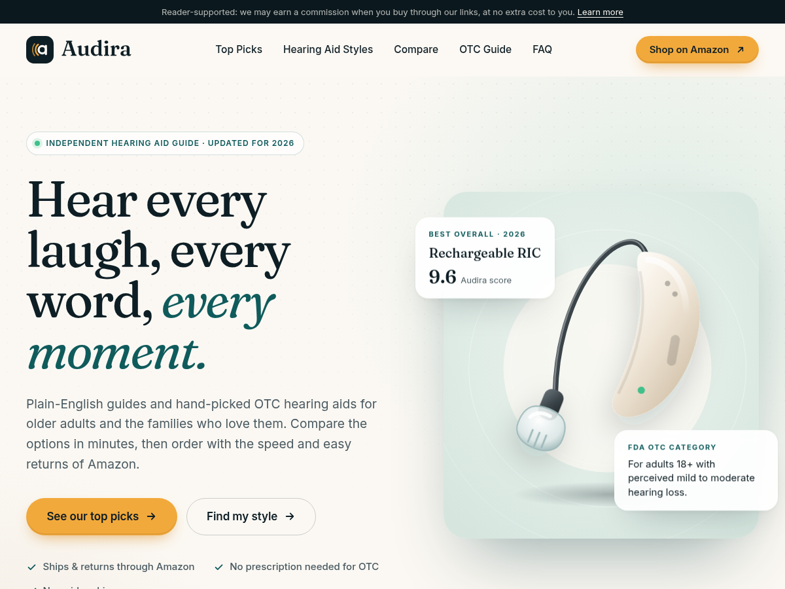

# Audira — Tema WordPress para afiliados de Amazon (EE. UU.)

Sitio de afiliados de Amazon.com sobre audífonos para adultos mayores, en inglés, listo para WordPress + Hostinger.

- **Tema:** carpeta [`audira/`](audira/) (tema de bloques / Full Site Editing).
- **Archivo para subir a WordPress:** [`dist/audira.zip`](dist/audira.zip).



## Qué incluye

| | |
|---|---|
| **Marca** | Logo nuevo ("a" con ondas de sonido) en SVG: `logo.svg`, `logo-light.svg` (fondo oscuro) y `logo-mark.svg` (ícono/favicon). |
| **Diseño** | Tipografías premium Fraunces + Inter alojadas en el tema (sin Google Fonts externas), paleta marfil / tinta / verde azulado, botones de compra ámbar, animaciones suaves y diseño responsive. |
| **Secciones** | Hero · barra de confianza · *Editor's Top Picks* (5 productos con puntuación y botón a Amazon) · estilos de audífonos con ficha desplegable y botones "Add 1/2/3 to cart" · tabla comparativa · guía OTC vs PSAP vs receta · metodología · 4 pasos · FAQ · llamado final · pie. |
| **Ilustraciones** | 10 ilustraciones vectoriales originales de audífonos (sin marcadores de "FOTO"). |
| **Afiliados** | Página **Ajustes → Audira Affiliate** para tu Tracking ID. Todos los enlaces de Amazon del sitio (incluidos los que escribas a mano) reciben tu tag automáticamente. |
| **Cumplimiento** | Aviso de afiliado arriba del header y en el pie, páginas *Affiliate Disclosure*, *Medical Disclaimer* y *About* creadas automáticamente, enlaces `rel="sponsored nofollow"`, sin precios ni estrellas copiados de Amazon (prohibido por el Operating Agreement), sin reseñas inventadas (prohibidas por la FTC). |
| **SEO** | Datos estructurados FAQPage (resultados enriquecidos en Google), HTML semántico, fuentes precargadas. |

## Paso a paso: publicarlo en Hostinger con tu dominio

1. **Instala WordPress** en hPanel → *Sitios web* → *Añadir sitio web* → *WordPress*, y elige el dominio `choicebrook.com`. Idioma del sitio: **English (United States)**.
2. **Descarga** `dist/audira.zip` de este repositorio (botón *Download raw file*). No lo descomprimas.
3. En WordPress: **Appearance → Themes → Add New Theme → Upload Theme** → elige `audira.zip` → **Install Now** → **Activate**.
   Al activarlo se crean la portada y las páginas legales.
4. **Settings → Audira Affiliate**: pega tu Tracking ID de Amazon Associates (termina en `-20`) y guarda.
5. **Settings → Permalinks** → *Post name* → *Save*.
6. **Settings → Privacy** → crea y publica tu *Privacy Policy*.
7. **Tus productos:** están en el menú **Products** (barra lateral izquierda de WordPress). Al actualizar el tema se importan solos tus 11 productos.
   - **Products → Add New Product:** título, descripción (editor), *Amazon link*, **varias imágenes** (una fila por imagen, marca la **Main**), badge, puntuación, ventajas, estilo, tipo de pérdida auditiva, características y rango de precio.
   - **Top pick on home page:** elige #1–#5 para que salga en el ranking de la portada (#1 = destacado). El resto aparece en *More products we recommend*.
   - Imágenes: en Amazon, clic derecho sobre cada foto → **Copiar dirección de imagen** → pégala en una fila. Las fotos se muestran desde Amazon (no las subas a Medios).
   - Catálogo público: **/products/** (con filtros y el *Hearing Aid Finder*). Cada producto tiene su página con galería.
8. **Site title:** Settings → General → *Site Title* (el logo y el pie usan este nombre).
9. Activa SSL en hPanel (*Seguridad → SSL*) si aún no está activo.

> Amazon Associates exige 3 ventas en los primeros 180 días. Mientras tanto, añade entradas (guías) desde **Posts → Add New**; aparecen en el blog con el mismo diseño.

## Asistente de IA (Google Gemini, gratis)

Un chat flotante que responde dudas de tus visitantes usando tu catálogo (productos, puntuaciones, estilos y FAQ).

1. Entra a **https://aistudio.google.com/apikey** con tu cuenta de Google → **Create API key** → copia la clave (empieza por `AIza…`). No necesitas tarjeta ni pagar el plan de AI Studio.
2. En WordPress: **Settings → Audira Affiliate → AI assistant (Google Gemini)** → marca **Enable**, pega la clave, deja el modelo `gemini-2.5-flash-lite` → **Guardar cambios**.
3. Abre tu web y pulsa **Ask our assistant** (abajo a la derecha).

Seguridad: la clave se guarda solo en tu servidor, nunca en la página. El chat solo acepta peticiones desde tu propio dominio, limita a 20 mensajes cada 10 minutos por visitante y tiene un tope diario configurable (800 por defecto) para no pasar del plan gratuito.

Privacidad: en el plan gratuito Google puede usar los mensajes para mejorar sus productos. El chat avisa a los visitantes que no compartan datos de salud personales; menciónalo también en tu Privacy Policy.

## Editar el diseño

- Textos de la portada: **Pages → Home** en el editor de bloques (cada sección es un patrón editable), o directamente en `audira/patterns/*.php`.
- Colores y tipografías: **Appearance → Editor → Styles**, o `audira/theme.json`.
- Estilos: `audira/assets/css/styles.css`.
- Para reemplazar ilustraciones por fotos reales, selecciona la imagen en el editor y usa *Replace*.

## Desarrollo

```bash
tools/build.sh                      # regenera dist/audira.zip
python3 tools/generate_illustrations.py   # regenera las ilustraciones SVG
```
